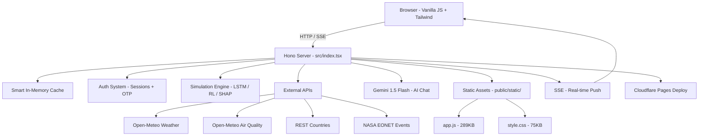

<<<<<<< HEAD
<div align="center">

<br/>

<h1>🌿 EcoTwin AI</h1>
<h3><em>A full-stack AI sustainability platform that monitors, simulates, and forecasts<br/>the environmental health of cities and nations in real time.</em></h3>

<br/>

[](https://nodejs.org/)
[](https://hono.dev/)
[](https://www.typescriptlang.org/)
[](https://vitejs.dev/)
[](https://pages.cloudflare.com/)
[](https://ai.google.dev/)

<br/>

---

</div>

## 📋 Table of Contents

- [Overview](#-overview)
- [The Problem](#-the-problem-ecotwin-ai-addresses)
- [Solution](#-solution--what-ecotwin-ai-delivers)
- [Key Features](#-key-features)
- [How It Works](#-how-it-works)
- [Architecture](#-architecture--data-flow)
- [Technology Stack](#-technology-stack)
- [Project Structure](#-project-structure)
- [Getting Started](#-getting-started)
- [Environment Variables](#-environment-variables--configuration)
- [How to Run](#-how-to-run)
- [API Reference](#-api-reference)
- [Screenshots & Demo](#-screenshots--demo)
- [Future Improvements](#-future-improvements)
- [Known Limitations](#-known-limitations)
- [Contributing](#-contributing)
- [Author](#-author)

---

## 🌍 Overview

**EcoTwin AI** is a production-grade, AI-powered sustainability intelligence platform built as a single-file full-stack application using the [Hono](https://hono.dev/) web framework on the backend and a vanilla JS + Tailwind CSS frontend — deployable to Cloudflare Pages in seconds.

It serves as a **command-center dashboard** for tracking environmental metrics across **50+ countries** and **15+ global cities**, running AI-driven simulations, detecting anomalies, and delivering real-time insights — all from one unified interface.

> **EcoTwin AI** → monitors planetary sustainability → simulates 10-year futures with an LSTM model → uses Gemini AI for intelligent Q&A → visualizes everything with Plotly, Chart.js, and Three.js.

---

## ❗ The Problem EcoTwin AI Addresses

Environmental data is fragmented, siloed across dozens of agencies, and rarely accessible in a decision-ready format. Policymakers, researchers, and sustainability analysts lack:

- A single platform to compare sustainability metrics across nations
- Real-time air quality, weather, and carbon market data in one view
- Accessible AI simulation tools to forecast the impact of policy changes
- Intuitive visualizations of complex climate datasets (SDGs, carbon budgets, threat forecasts)

---

## ✅ Solution — What EcoTwin AI Delivers

| Problem | EcoTwin Solution |
|---|---|
| Fragmented environmental data | Live APIs aggregated (Open-Meteo, REST Countries, NASA EONET) |
| No simulation capability | LSTM-style 10-year projection engine with confidence bands |
| Opaque AI decisions | SHAP explainability showing per-feature contributions |
| Complex policy tradeoffs | Policy Sandbox: carbon tax, renewable mandates, etc. |
| No AI sustainability assistant | Gemini 1.5 Flash chat with live system context injection |
| Static dashboards | Live SSE-powered updates, real-time carbon market pulse |

---

## ✨ Key Features

<details>
<summary><strong>📊 Dashboard & Visualization</strong></summary>

- **Real-Time KPI Cards** — Energy, Water, Traffic, Air Quality, Noise, Temperature
- **Interactive World Map (Choropleth)** — 50 countries with drill-down stats
- **3D Globe (Three.js WebGL)** — Immersive planetary data visualization
- **Carbon Market Pulse** — Live EU ETS carbon credit pricing, renewable & fossil indices
- **Global Atmospheric CO₂** — Modeled on NOAA Mauna Loa seasonal trend data
- **Live Ticker Bars** — Persistent viewport-edge telemetry for CO₂, temp, sea level

</details>

<details>
<summary><strong>🤖 AI & Machine Learning Modules</strong></summary>

- **LSTM Neural Simulator** — 10-year environmental projections with confidence interval bands
- **RL Policy Optimizer (DQN)** — Reinforcement learning agent that discovers the optimal policy path
- **SHAP Explainable AI** — Shapley-value-style feature attribution for sustainability scores
- **Anomaly Detection** — Variance-heuristic engine for identifying environmental outliers (LOW / MEDIUM / HIGH / CRITICAL)
- **Gemini 1.5 Flash AI Chat** — Conversational AI with live system context — multilingual (9 languages)

</details>

<details>
<summary><strong>🛰️ Satellite Intelligence Module</strong></summary>

- **NASA EONET Integration** — Real open events feed for wildfires, storms, volcanoes
- **NASA GIBS Tile URLs** — VIIRS True Color satellite imagery (250m resolution)
- **Simulated CNN Analysis** — Bounding box detections, heatmaps, class probabilities
- **NDVI Timeseries** — 25-year vegetation index tracking with anomaly detection
- **Emission Hotspots** — TROPOMI/Sentinel-5P style CO₂ flux mapping for 10 global regions

</details>

<details>
<summary><strong>🌐 Real-Time Data Integration</strong></summary>

- **Open-Meteo API** — Free, no-key-required live weather for 15+ global cities
- **Open-Meteo Air Quality API** — European AQI, PM2.5, PM10, NO₂, SO₂, O₃
- **REST Countries API** — Country metadata (capitals, flags, currencies, languages)
- **NASA EONET API** — Live open natural events
- **Server-Sent Events (SSE)** — True server push for real-time updates every 2 seconds

</details>

<details>
<summary><strong>🏙️ City & Policy Intelligence</strong></summary>

- **City Benchmarking** — 15 global cities with EV adoption, green space, solar, waste recycling
- **Policy Sandbox** — Simulate carbon tax, renewable mandates, green buildings, smart grid
- **Peer Comparison Engine** — Radar chart comparison of up to 4 countries across 7 metrics
- **SDG Tracker** — UN SDG 6, 7, 11, 13, 14, 15 progress with trend sparklines
- **Climate Risk Lab** — Physical & transition risk scoring (heat stress, flood, coastal, water scarcity)
- **Carbon Budget Calculator** — Global 1.5°C / 2°C budget with depletion trajectories

</details>

<details>
<summary><strong>👤 Auth, Export & Admin</strong></summary>

- **Multi-role Auth** — Login/register with OTP verification, session tokens, role-based access
- **Data Export** — CSV and JSON export of all country sustainability data
- **Admin Panel** — User management, session stats, API call count, cache hit rate
- **Multilingual UI** — 9 languages: English, Spanish, French, German, Chinese, Arabic, Hindi, Portuguese
- **Dynamic News Feed** — Filterable sustainability news with live CO₂ ppm injected into summaries

</details>

---

## 🔄 How It Works

```
User Input / Sliders / Queries
        │
        ▼
  ┌─────────────────────────────────────┐
  │   Hono API Server (src/index.tsx)   │
  │   • Auth / Sessions                  │
  │   • LSTM Simulation Engine           │
  │   • RL Optimizer (DQN sim)           │
  │   • SHAP Attribution                 │
  │   • Anomaly Detection                │
  │   • Gemini 1.5 Flash AI Chat         │
  └───────────┬─────────────────────────┘
              │  Fetches from
    ┌──────────┼──────────────────────┐
    │          │                      │
    ▼          ▼                      ▼
Open-Meteo  REST Countries       NASA EONET
(Weather +  (Country metadata,   (Natural events:
 Air Quality) flags, languages)   wildfires, storms)
    │
    ▼
Smart Cache (TTL-based, in-memory per route)
    │
    ▼
JSON API Response → Frontend (app.js / style.css)
    │
    ▼
Plotly.js Charts | Chart.js | Three.js 3D Globe
   GSAP Animations | AOS Scroll Effects
    │
    ▼
Interactive Dashboard in Browser
```

---

## 🏗️ Architecture & Data Flow



---

## 🛠️ Technology Stack

| Layer | Technology | Purpose |
|---|---|---|
| **Runtime** | Node.js 22.x | JavaScript runtime |
| **Web Framework** | Hono 4.x | Ultra-fast edge-compatible HTTP server |
| **Language** | TypeScript 5.x | Type safety across all server code |
| **Build Tool** | Vite 6.x | Lightning-fast dev server & bundler |
| **Deploy Target** | Cloudflare Pages | Edge deployment via Wrangler |
| **AI Engine** | Google Gemini 1.5 Flash | Conversational sustainability Q&A |
| **Styling** | Tailwind CSS (CDN) + Custom CSS | Utility-first + Synthwave Eco design |
| **Charts** | Plotly.js 2.32 | Interactive scientific charts |
| **Charts** | Chart.js 4.4 | Canvas-based responsive charts |
| **3D Viz** | Three.js 0.162 | WebGL 3D globe |
| **Animations** | GSAP 3.12 | Professional-grade UI animations |
| **Scroll FX** | AOS 2.3 | Scroll-triggered reveal animations |
| **UI Feedback** | SweetAlert2 11 | Styled modal dialogs |
| **Fonts** | Inter + Orbitron + Fira Code | Google Fonts typography stack |
| **Icons** | Font Awesome 6.5 | Icon library |
| **Weather** | Open-Meteo API | Free, no-key weather + AQI |
| **Countries** | REST Countries API | Country metadata (flags, languages) |
| **Satellite Events** | NASA EONET API | Live natural disaster feed |
| **Satellite Imagery** | NASA GIBS WMTS | VIIRS true-color tile URLs |

---

## 📁 Project Structure

```
ecotwin-main/
│
├── src/
│   ├── index.tsx          # Entire backend (~2000 lines): Hono server, 30+ API routes, HTML shell
│   └── renderer.tsx       # Static file serving helper
│
├── public/
│   └── static/
│       ├── app.js         # Full frontend (289KB) — all UI logic, charts, auth, tabs
│       └── style.css      # Custom CSS (75KB) — Synthwave Eco design system
│
├── package.json           # Dependencies: hono, @google/generative-ai, openai, vite, wrangler
├── vite.config.ts         # Vite + Hono dev-server adapter configuration
├── tsconfig.json          # TypeScript: ESNext, Bundler module resolution, Hono JSX
├── wrangler.jsonc         # Cloudflare Pages deployment configuration
├── ecosystem.config.cjs   # PM2 process manager config (production)
└── .gitignore             # Ignores: dist/, node_modules/, .env, .dev.vars
```

> **Architecture insight:** The entire backend lives in a single `src/index.tsx` file, serving the HTML shell, all 30+ REST API routes, SSE streams, and business logic — a deliberate monolithic design for Cloudflare Workers edge compatibility.

---

## 🚀 Getting Started

### Prerequisites

| Requirement | Version | Notes |
|---|---|---|
| [Node.js](https://nodejs.org/) | 18+ (tested on 22.x) | Required |
| npm | 9+ | Comes with Node.js |
| Internet connection | — | For external API calls |
| Gemini API Key | Optional | For AI chat feature only |

### Installation

```bash
# 1. Clone the repository
git clone https://github.com/YOUR_USERNAME/ecotwin-main.git
cd ecotwin-main

# 2. Install all dependencies
npm install
```

---

## 🔐 Environment Variables / Configuration

EcoTwin AI works **without any API keys** for all core features. The only optional configuration is for the Gemini AI chat.

| Variable | Required | Where to set | Purpose |
|---|---|---|---|
| `GEMINI_API_KEY` | Optional | `.dev.vars` (local) or Cloudflare secret | Powers the AI chat assistant |

**For local development:**
```bash
# Create a .dev.vars file in the project root (already in .gitignore)
echo "GEMINI_API_KEY=your_gemini_api_key_here" > .dev.vars
```

**For Cloudflare Pages deployment:**
```bash
wrangler secret put GEMINI_API_KEY
```

> 💡 Get a free Gemini API key at [Google AI Studio](https://aistudio.google.com/). Without a key, all platform features work normally — only the AI chat tab shows a configuration message.

---

## ▶️ How to Run

### Development Server (Recommended)

```bash
npm run dev
# Server starts at: http://localhost:5173/
```

### Production Preview (via Wrangler)

```bash
npm run build     # Build the project
npm run preview   # Preview with Wrangler Pages dev server
```

### Deploy to Cloudflare Pages

```bash
npm run deploy    # Builds and deploys to Cloudflare Pages
```

### Default Login Credentials

| Role | Email | Password |
|---|---|---|
| Admin | `admin@ecotwin.ai` | `admin123` |
| Analyst | `analyst@ecotwin.ai` | `demo123` |

> You can also register a new account directly from the UI. OTP is shown in the server response (demo mode).

---

## 📡 API Reference

All endpoints are served from the same Hono server at `http://localhost:5173`.

<details>
<summary><strong>Authentication Routes</strong></summary>

| Method | Endpoint | Description |
|---|---|---|
| `POST` | `/auth/login` | Login with email + password |
| `POST` | `/auth/register` | Register new user (returns OTP) |
| `POST` | `/auth/verify-otp` | Verify OTP to activate account |
| `POST` | `/auth/logout` | Invalidate session token |
| `GET` | `/auth/me` | Get current user profile |
| `PUT` | `/auth/profile` | Update name, org, language |

</details>

<details>
<summary><strong>Data & Analytics Routes</strong></summary>

| Method | Endpoint | Description |
|---|---|---|
| `GET` | `/world_data` | 50-country sustainability dataset (enriched via REST Countries) |
| `GET` | `/realtime` | Live sensor telemetry with real weather/AQI from Open-Meteo |
| `GET` | `/realtime/latest` | Latest single telemetry reading |
| `GET` | `/global_ticker` | CO₂ ppm, temp anomaly, renewable capacity, carbon market |
| `GET` | `/market_data` | EU ETS carbon price, renewable/fossil indices, energy prices |
| `GET` | `/historical/:country` | 15-year historical trend for a given country code |
| `GET` | `/analytics/enterprise` | Regional aggregates, KPIs, monthly trends |
| `GET` | `/sdg_data` | UN SDG 6/7/11/13/14/15 progress data |
| `GET` | `/anomaly_data` | 30-day anomaly detection dataset |
| `GET` | `/carbon_budget` | Global 1.5°C/2°C carbon budget calculations |
| `GET` | `/cities` | 15 global cities with sustainability scores + real weather |
| `GET` | `/news_feed` | Filterable sustainability news (category, sentiment) |
| `GET` | `/weather/:city` | Real weather for a named city |
| `GET` | `/planet_health` | 6-dimension composite planetary health score |
| `GET` | `/co2_race` | Per-country CO₂ race-chart data by year (1990–2024) |

</details>

<details>
<summary><strong>AI & Simulation Routes</strong></summary>

| Method | Endpoint | Description |
|---|---|---|
| `POST` | `/simulate_future` | LSTM 10-year projection with confidence bands |
| `POST` | `/simulate/compare` | Baseline vs. projected scenario comparison |
| `GET` | `/simulate/history` | Last 20 simulation runs |
| `POST` | `/shap/explain` | SHAP feature attribution for sustainability score |
| `POST` | `/rl_optimize` | DQN reinforcement learning optimizer simulation |
| `POST` | `/climate_risk` | Physical + transition risk scoring |
| `POST` | `/policy_sim` | Policy impact simulation (cost, jobs, score delta) |
| `POST` | `/peer_compare` | Multi-country radar comparison |
| `POST` | `/ai_query` | Gemini 1.5 Flash AI chat with live context |

</details>

<details>
<summary><strong>Satellite Intelligence Routes</strong></summary>

| Method | Endpoint | Description |
|---|---|---|
| `GET` | `/satellite/regions` | All monitored regions with NASA GIBS tile URLs |
| `GET` | `/satellite/analyze/:regionId` | CNN analysis for a specific region |
| `GET` | `/satellite/live_feed` | Live scan feed for all regions |
| `GET` | `/satellite/global_stats` | Forest loss, urban expansion, ice sheet stats |
| `GET` | `/satellite/ndvi_timeseries` | 25-year NDVI vegetation index |
| `GET` | `/satellite/emission_hotspots` | Top 10 global CO₂ emission hotspots |
| `GET` | `/satellite/ml_forecast` | 18-month ML environmental forecast |
| `GET` | `/satellite/sse` | SSE stream for real-time satellite scan events |
| `POST` | `/satellite/compare` | Year-over-year satellite comparison for a region |

</details>

<details>
<summary><strong>Other Routes</strong></summary>

| Method | Endpoint | Description |
|---|---|---|
| `GET` | `/sse/live` | Server-Sent Events stream (2s updates) |
| `GET` | `/threat_forecast` | 18-month AI threat timeline (uses NASA EONET if available) |
| `GET` | `/export/csv` | Download all country data as CSV |
| `GET` | `/export/json` | Download all country data as JSON |
| `GET` | `/i18n/:lang` | UI translation strings (en/es/fr/de/zh/ar/hi/pt) |
| `GET` | `/admin/users` | Admin: list all users |
| `GET` | `/admin/stats` | Admin: system stats (sessions, API calls, cache) |
| `PUT` | `/admin/users/:id/role` | Admin: update user role |

</details>

---

## 📸 Screenshots / Demo

> **📌 Screenshots not yet captured.** Run the application locally, take screenshots, and save them to the paths below for them to appear in this README automatically.

```
docs/
└── screenshots/
    ├── 01_dashboard.png          # Main dashboard with KPI cards and world map
    ├── 02_world_map.png          # Choropleth world map with country drill-down
    ├── 03_simulator.png          # LSTM 10-year simulation with confidence bands
    ├── 04_rl_optimizer.png       # Reinforcement Learning DQN training chart
    ├── 05_realtime_monitor.png   # Live sensor telemetry feed
    ├── 06_ai_chat.png            # Gemini AI chat with live context
    ├── 07_satellite.png          # Satellite intelligence module
    ├── 08_sdg_tracker.png        # UN SDG progress tracker
    ├── 09_carbon_budget.png      # Carbon budget depletion chart
    ├── 10_city_benchmark.png     # City sustainability benchmarking
    ├── 11_anomaly_radar.png      # Anomaly detection timeline
    └── 12_policy_sandbox.png     # Policy impact simulator
```

---

## 🔮 Future Improvements

- [ ] **Persistent Database** — Replace in-memory store with Cloudflare D1 (SQLite) or PostgreSQL
- [ ] **Real LSTM Model** — Replace algorithmic projection with a trained model served via API
- [ ] **Real-time Map** — Upgrade choropleth to Mapbox GL or deck.gl for true geospatial rendering
- [ ] **WebSocket Support** — Replace SSE with bidirectional WebSocket for lower-latency telemetry
- [ ] **Mobile App** — React Native companion app for field sustainability reporting
- [ ] **Satellite Image Processing** — Actual CNN inference via TensorFlow.js or a cloud model API
- [ ] **Alert System** — Email/webhook alerts when anomalies breach configurable thresholds
- [ ] **Historical Data API** — Integration with actual World Bank & NOAA historical datasets

---

## ⚠️ Known Limitations

| Limitation | Details |
|---|---|
| **In-memory storage** | Users, sessions, and simulation history reset on server restart |
| **Simulated AI models** | LSTM, RL, SHAP, and CNN modules use algorithmic simulations, not trained ML models |
| **Rate limits on external APIs** | Open-Meteo has usage limits; results are cached (10 min weather, 1 hr country data) |
| **NASA GIBS tiles** | Satellite tiles are real URL builders but images may not always load |
| **AI chat requires API key** | Without `GEMINI_API_KEY`, the AI assistant returns a configuration prompt |
| **No persistent sessions** | All users are logged out on server restart |

---

## 🤝 Contributing

Contributions are welcome! To contribute:

```bash
# 1. Fork the repository
# 2. Create a feature branch
git checkout -b feature/your-feature-name

# 3. Make your changes (follow existing code style)
# 4. Test thoroughly
npm run dev

# 5. Submit a pull request with a clear description
```

Please do not change the UI theme, colors, or layout without prior discussion.

---

## 👤 Author

<div align="center">

**Built with 💚 for planetary intelligence**

*A demonstration of full-stack TypeScript + Cloudflare Workers edge deployment + Gemini AI integration + real-time data engineering.*

**[View Source](src/index.tsx)** · **[Run Locally](#-how-to-run)** · **[Deploy to Cloudflare](#deploy-to-cloudflare-pages)**

© 2026 EcoTwin AI Platform — Engineered for Planetary Resilience.

</div>
=======
# STEG | Secure Steganographic Communication System 🛡️

STEG is a premium, high-integrity security tool designed to enable confidential communication by hiding encrypted messages within ordinary images. By combining **AES-256 Encryption** with **LSB Steganography**, STEG ensures that your data is not only unreadable but also completely invisible to the naked eye.

---

## ✨ Features

- **Dual-Layer Security**: Protect your data twice. First with industry-standard encryption, then by hiding it inside an image carrier.
- **Advanced AES-256 Encryption**: Messages are encrypted using a user-defined key before being embedded, ensuring maximum cryptographic strength.
- **LSB Steganography**: Utilizes Least Significant Bit embedding to hide data in the pixel shaders of images with zero detectable visual degradation.
- **Secure Extraction Portal**: A dedicated "Decode Section" with privacy blur allows you to clarify and extract messages only after multi-factor authentication.
- **Hashed Password Control**: Access to images is guarded by `bcrypt` hashing, ensuring your vault remains private even at the database level.
- **Interactive Security Dashboard**: Monitor your assets in a futuristic, neon-cyan themed "Cyber-Vault."
- **One-Click Purge**: Securely delete your encrypted assets and messages from the server with a single click after decryption.

## 🛠️ Tech Stack

- **Frontend**: 
    - **HTML5 & CSS3**: Custom vanilla design system with Glassmorphism and Neon-Cyber aesthetics.
    - **JavaScript**: Interactive elements and clipboard integration.
    - **Libraries**: Chart.js (Analytics), AOS.js (Animations), SweetAlert2 (Premium Alerts), Popper.js.
- **Backend**: 
    - **Flask**: Python-based micro-framework for robust routing and server-side logic.
    - **Pillow (PIL)**: Advanced image processing for LSB data embedding.
    - **PyCryptodome**: High-level cryptographic library for AES-256 implementation.
    - **Flask-Bcrypt**: Secure password hashing.
- **Database**: 
    - **SQLite**: Lightweight, relational database for secure asset tracking.

## 🚀 How to Execute

### 1. Prerequisites
Ensure you have **Python 3.8+** installed on your system.

### 2. Clone and Setup
```bash
# Clone the repository (or navigate to current folder)
cd STEG

# Install dependencies
pip install -r requirements.txt
```

### 3. Initialize the Database
```bash
# Run the database initialization script
python database/init_db.py
```

### 4. Run the Application
```bash
# Start the Flask server
python app.py
```

### 5. Access the Portal
Open your web browser and navigate to:
**[http://127.0.0.1:5000](http://127.0.0.1:5000)**

---

## 🔒 Security Workflow

1. **Encode**: Upload a carrier image, enter your secret message, and set two separate passwords—one for Vault Access and one for Message Encryption.
2. **Decode**: Navigate to the **Decode Section** (Vault). Your assets will be blurred for privacy. Click **"OPEN DECODE PORTAL"** and enter your Vault Access Password.
3. **Extract**: Provide the Encryption Key to reveal the hidden message.
4. **Purge**: Use the Purge button to completely erase the data once communication is complete.

---
*Developed with ❤️ for Secure Communication*
>>>>>>> 96e224e56dd532e17b2957984e5d862a5ec6c352
