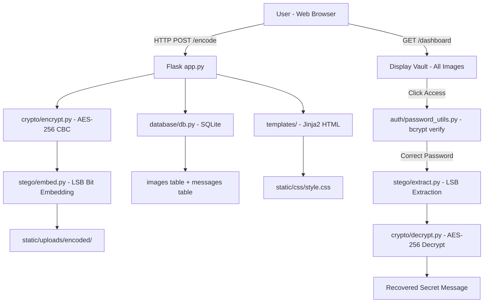

<div align="center">

<br/>

<h1>🌾 Krishi-AI</h1>

<h3><em>Secure. Hidden. Invisible.</em></h3>

<p>A dual-layer security system combining <strong>AES-256 encryption</strong> and <strong>LSB steganography</strong><br/>to hide encrypted messages invisibly inside ordinary images.</p>

<br/>

[](https://www.python.org/)
[](https://flask.palletsprojects.com/)
[](https://pillow.readthedocs.io/)
[](https://pycryptodome.readthedocs.io/)
[](https://www.sqlite.org/)
[](https://pypi.org/project/bcrypt/)

<br/>

---

</div>

## 📋 Table of Contents

- [Overview](#-overview)
- [The Problem](#-the-problem-it-solves)
- [How It Works](#-how-it-works)
- [Key Features](#-key-features)
- [Architecture](#-architecture--data-flow)
- [Technology Stack](#-technology-stack)
- [Project Structure](#-project-structure)
- [Getting Started](#-getting-started)
- [Prerequisites](#prerequisites)
- [Installation](#installation)
- [How to Run](#-how-to-run)
- [Usage](#-usage)
- [Screenshots / Demo](#-screenshots--demo)
- [Known Limitations](#-known-limitations)
- [Future Improvements](#-future-improvements)
- [Contributing](#-contributing)
- [Author](#-author)

---

## 🌾 Overview

**Krishi-AI** is a web-based steganographic communication system that allows users to **hide AES-256 encrypted messages inside PNG/JPG images** using LSB (Least Significant Bit) steganography — making the hidden message completely invisible to the human eye.

The platform also provides a **Secure Vault** — a password-protected dashboard to store, access, and decode all encoded images.

> **Recruiter Summary:** Built a full-stack Flask application that implements dual-layer security (AES-256 + LSB steganography) from scratch, with a SQLite vault for asset management, bcrypt-hashed access control, and an animated dark-mode web UI.

---

## ❗ The Problem It Solves

Standard encryption is secure but *visible* — anyone can see that a message has been encrypted and target it. **Steganography** solves this by hiding the very existence of the message.

Krishi-AI combines **both** techniques:

| Challenge | Krishi-AI Solution |
|---|---|
| Encrypted messages are obvious targets | LSB steganography makes the message invisible inside an image |
| Steganography without encryption is readable if detected | AES-256 encryption ensures message confidentiality even if image is extracted |
| No persistent storage for encoded images | SQLite vault with bcrypt-secured password per image |
| Poor UX for cryptographic tools | Premium dark-mode web interface with animations and flash feedback |

---

## 🔄 How It Works

```
User writes a secret message + sets two passwords
        │
        ▼
AES-256 Encryption (PyCryptodome, CBC Mode)
 Password → SHA-256 → 256-bit key
 Message → Padded → Encrypted → Base64 encoded
        │
        ▼
LSB Steganography (Pillow)
 Encrypted message → Binary string (8 bits/char)
 Binary bits → Overwrite Least Significant Bit of each RGB channel
 Delimiter (16-bit) appended to mark message end
        │
        ▼
Encoded Image saved to disk + stored in SQLite vault
 (access_password bcrypt-hashed, encrypted_data stored)
        │
        ▼
Secure Vault (Dashboard)
 Browse stored images → Enter Access Password
        │
        ▼
Extraction + Decryption
 LSB bits extracted → Binary → encrypted string
 Encryption Password → SHA-256 → AES-256 decrypt
        │
        ▼
Original Message Recovered
```

---

## ✨ Key Features

<details>
<summary><strong>🔐 Dual-Layer Security</strong></summary>

- **AES-256 Encryption (CBC Mode)** — Message is encrypted using a SHA-256 derived key before steganography
- **LSB Steganography** — Encrypted binary data is distributed across the Least Significant Bits of R, G, B channels
- **Dual Password System** — Separate `access_password` (bcrypt-hashed, for vault access) and `encryption_password` (for AES decryption)
- **bcrypt Hashing** — Access passwords are never stored in plaintext

</details>

<details>
<summary><strong>🗄️ Secure Image Vault</strong></summary>

- **SQLite Database** — All encoded images tracked with metadata (name, path, hashed password)
- **Password-Protected Access** — Each image requires its unique access password to open
- **Named Assets** — Each encoded image can have a custom display name
- **Delete with Authentication** — Images can only be deleted after verifying the access password

</details>

<details>
<summary><strong>🎨 Web Interface</strong></summary>

- **Dark Synthwave UI** — Deep black background with amber/orange neon accent colors
- **AOS Scroll Animations** — Cards and sections animate on scroll via AOS.js
- **SweetAlert2 Flash Messages** — Beautiful modal-style alerts for encode success/error
- **Responsive Navbar** — Scrolled blur effect, mobile-compatible
- **Chart.js Analytics** — Security insights chart on the homepage
- **Password Toggle** — Eye icon to show/hide passwords on all forms

</details>

<details>
<summary><strong>📦 Flask Backend</strong></summary>

- **5 Routes** — `/` (home), `/encode`, `/dashboard`, `/access/<id>`, `/decode/<id>`, `/delete/<id>`
- **File Upload Handling** — `werkzeug.utils.secure_filename` for safe uploads
- **Modular Architecture** — Separate modules for `auth/`, `crypto/`, `stego/`, `database/`
- **Flash Messaging** — Full feedback system for success, error, and warning states

</details>

---

## 🏗️ Architecture & Data Flow



---

## 🛠️ Technology Stack

| Layer | Technology | Purpose |
|---|---|---|
| **Language** | Python 3.10+ | Core application language |
| **Web Framework** | Flask 3.x | HTTP routing, templates, sessions |
| **Templating** | Jinja2 (built-in) | HTML rendering with Flask |
| **Steganography** | Pillow 12.x | Image pixel manipulation (RGB LSB) |
| **Encryption** | PyCryptodome 3.x | AES-256 CBC mode encryption/decryption |
| **Password Hashing** | bcrypt 5.x | Secure access password storage |
| **Database** | SQLite 3 | Lightweight embedded database |
| **Fonts** | Outfit (Google Fonts) | Clean, modern UI typography |
| **Icons** | Font Awesome 6.4 | UI iconography |
| **Animations** | AOS.js 2.3 | Scroll-triggered reveal animations |
| **Alerts** | SweetAlert2 11 | Styled modal dialogs |
| **Charts** | Chart.js | Security analytics chart on homepage |

---

## 📁 Project Structure

```
krishi-ai/
│
├── app.py                  # Main Flask application — all routes and view logic
├── config.py               # Configuration: paths, SECRET_KEY, database path
├── requirements.txt        # Python dependencies: Flask, Pillow, pycryptodome, bcrypt
│
├── auth/
│   └── password_utils.py   # bcrypt hash_password() and verify_password()
│
├── crypto/
│   ├── encrypt.py          # AES-256 CBC encryption (PyCryptodome)
│   └── decrypt.py          # AES-256 CBC decryption
│
├── stego/
│   ├── embed.py            # LSB steganography — embeds binary data into image pixels
│   └── extract.py          # LSB extraction — reads hidden binary data from pixels
│
├── database/
│   ├── db.py               # SQLite connection helper (get_db)
│   ├── init_db.py          # Database initialization script
│   ├── models.py           # CREATE TABLE statements (images, messages)
│   └── steg.db             # SQLite database file (auto-created)
│
├── templates/
│   ├── base.html           # Base layout: navbar, footer, flash messages, scripts
│   ├── index.html          # Homepage: hero, feature cards, security chart
│   ├── encode.html         # Encode form: image upload + message + passwords
│   ├── dashboard.html      # Vault: grid of all encoded images
│   ├── access.html         # Password gate before decoding
│   └── decode.html         # Decoded message display
│
└── static/
    ├── css/style.css       # Custom dark-mode CSS (7.8KB)
    ├── img/                # Logo and background images
    │   ├── logo.png
    │   ├── hero-bg.png
    │   ├── encode-bg.png
    │   └── vault-bg.png
    └── uploads/            # Stored image files (auto-created)
        ├── original/       # Original uploaded images
        └── encoded/        # Steganography-encoded images
```

---

## 🚀 Getting Started

### Prerequisites

| Requirement | Version | Notes |
|---|---|---|
| [Python](https://www.python.org/) | 3.10+ | Required |
| pip | Latest | Comes with Python |

### Installation

```bash
# 1. Clone the repository
git clone https://github.com/jeswanth90630/Ecotwin.git
cd Ecotwin

# 2. (Recommended) Create and activate a virtual environment
python -m venv venv
venv\Scripts\activate        # Windows
# source venv/bin/activate   # Linux/macOS

# 3. Install dependencies
pip install -r requirements.txt

# 4. Initialize the database (only needed on first run)
python database/init_db.py
```

---

## ▶️ How to Run

```bash
python app.py
# Server starts at: http://127.0.0.1:5000/
```

The Flask development server starts with debug mode enabled. Open your browser and navigate to `http://127.0.0.1:5000`.

---

## 📖 Usage

### 1. Encode a Message

1. Go to `http://127.0.0.1:5000/encode`
2. Upload a PNG or JPG image (must be large enough to hold your message)
3. Enter your secret message
4. Set an **Access Password** (used to open this image from the vault)
5. Set an **Encryption Password** (used to decrypt the hidden message)
6. Give the image a display name
7. Click **Encode** — your image is stored in the Secure Vault

### 2. Decode a Message

1. Go to `http://127.0.0.1:5000/dashboard` (the Vault)
2. Click on the encoded image you want to access
3. Enter the **Access Password** to unlock it
4. Enter the **Encryption Password** to decrypt and reveal the hidden message

### 3. Delete an Image

From the dashboard, click **Delete** on any image. You must provide the correct **Access Password** to confirm deletion.

---

## 📸 Screenshots / Demo

> **📌 Screenshots not yet added.** Run the application and capture screenshots at these pages, then save them to the paths below:

```
docs/
└── screenshots/
    ├── 01_home.png          # Homepage with hero section and feature cards
    ├── 02_encode.png        # Encode form with image upload and password fields
    ├── 03_dashboard.png     # Secure vault showing all encoded images
    ├── 04_access.png        # Password gate screen before decoding
    └── 05_decode.png        # Decoded message reveal screen
```

Once saved, add to this README:
```markdown


```

---

## ⚠️ Known Limitations

| Limitation | Details |
|---|---|
| **Image size requirement** | The image must be large enough to hold the binary-encoded message (approx. 1 pixel per 3 bits of message) |
| **PNG recommended** | JPEG compression may corrupt LSB bits; use PNG for reliable encode/decode |
| **No user authentication** | The vault is shared — any visitor can access the dashboard |
| **In-process server** | `python app.py` uses Flask's built-in dev server, not suitable for production |
| **Local storage only** | Uploaded images are stored on the local filesystem |
| **Hardcoded SECRET_KEY** | `config.py` has a hardcoded secret key — change before deploying |

---

## 🔮 Future Improvements

- [ ] **User Authentication** — Per-user vaults with login/register
- [ ] **JPEG Safe Mode** — Convert JPEG to PNG before embedding to prevent compression artifacts
- [ ] **Capacity Preview** — Show how many characters the selected image can hold before encoding
- [ ] **Cloud Storage** — Store images on AWS S3 or Cloudflare R2 instead of local disk
- [ ] **API Mode** — REST API endpoints for programmatic encode/decode
- [ ] **Mobile Optimization** — Improved responsive layout for small screens
- [ ] **Production Deployment** — Gunicorn + Nginx setup documentation

---

## 🤝 Contributing

```bash
# 1. Fork the repository
# 2. Create a feature branch
git checkout -b feature/your-feature-name

# 3. Make your changes
# 4. Test thoroughly
python app.py

# 5. Submit a pull request
```

---

## 👤 Author

<div align="center">

**Built with 🔐 for secure, invisible communication**

*A demonstration of applied cryptography + steganography + full-stack Python web development.*

**[Source Code](https://github.com/jeswanth90630/Ecotwin)** · **[Run Locally](#-how-to-run)**

© 2026 Krishi-AI — Secure Steganographic Communication Platform

</div>
