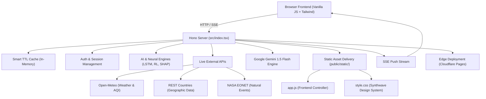

<div align="center">

<br/>

<h1>🌿 EcoTwin AI</h1>

<h3><em>AI Digital Sustainability & Planetary Intelligence Platform</em></h3>

<p>A full-stack AI platform that monitors, simulates, and forecasts<br/>the environmental health of 50+ nations and 15+ global cities in real time.</p>

<br/>

[](https://nodejs.org/)
[](https://hono.dev/)
[](https://www.typescriptlang.org/)
[](https://vitejs.dev/)
[](https://pages.cloudflare.com/)
[](https://tailwindcss.com/)
[](https://ai.google.dev/)
[](LICENSE)

<br/>

---

</div>

## 📋 Table of Contents

- [Overview](#-overview)
- [The Problem EcoTwin AI Addresses](#-the-problem-ecotwin-ai-addresses)
- [Solution](#-solution--what-ecotwin-ai-delivers)
- [Key Features](#-key-features)
- [How It Works](#-how-it-works)
- [Architecture & Data Flow](#-architecture--data-flow)
- [Technology Stack](#-technology-stack)
- [Project Structure](#-project-structure)
- [Getting Started](#-getting-started)
- [Environment Setup](#-environment-setup)
- [How to Run & Build](#-how-to-run--build)
- [API Reference](#-api-reference)
- [Screenshots & Demo](#-screenshots--demo)
- [Known Limitations](#-known-limitations)
- [Future Improvements](#-future-improvements)
- [Contributing](#-contributing)
- [Author](#-author)

---

## 🌍 Overview

**EcoTwin AI** is a high-performance, AI-driven sustainability intelligence platform engineered for environmental telemetry, multi-scenario simulation, and climate policy optimization.

Built as an edge-compatible full-stack web application powered by **Hono**, **TypeScript**, and **Vite**, EcoTwin AI aggregates real-time telemetry from multiple global environmental APIs, applies neural simulation models (LSTM, RL, SHAP, Anomaly Detection), and delivers actionable analytics via hardware-accelerated 3D WebGL visualizations and interactive dashboards.

> **💡 Recruiter Summary (30-Second Snapshot):**
> **EcoTwin AI** → Aggregates live weather, air quality, NASA disaster telemetry, and carbon market data → Runs 10-year LSTM neural simulations and Deep Q-Network RL policy optimization → Integrates Google Gemini 1.5 Flash for live-context AI Q&A → Deploys seamlessly to Cloudflare Pages edge network.

---

## ❗ The Problem EcoTwin AI Addresses

Global environmental data is fragmented, locked behind siloed databases, and rarely decision-ready. Policymakers, sustainability analysts, and researchers face critical challenges:

- **Data Fragmentation:** Weather, air quality, carbon pricing, and disaster events live in separate isolated systems.
- **Lack of Predictive Tools:** Traditional dashboards display static historical numbers without forward-looking AI simulation capabilities.
- **Black-Box AI Decisions:** Machine learning outputs often lack explainability, making them hard to trust for policy planning.
- **Complex Interventions:** Measuring the impact of policy changes (e.g., carbon tax vs. renewable energy mandates) requires complex multi-variable modeling.

---

## ✅ Solution — What EcoTwin AI Delivers

EcoTwin AI solves these problems through an integrated digital twin architecture:

| Problem | EcoTwin AI Solution |
|---|---|
| Isolated climate datasets | Live API aggregation: Open-Meteo Weather & AQI, REST Countries, NASA EONET |
| Static non-predictive views | LSTM Neural Simulator predicting 10-year environmental trajectories with confidence bands |
| Black-box ML models | SHAP (Shapley Additive exPlanations) game-theoretic feature attribution |
| Complex policy trade-offs | Interactive Policy Sandbox calculating cost, job creation, and score deltas |
| Generic AI assistants | Gemini 1.5 Flash AI chatbot dynamically injected with real-time live system metrics |
| Heavy server infrastructure | Lightweight Hono architecture deployable to edge networks (Cloudflare Pages) |

---

## ✨ Key Features

<details>
<summary><strong>📊 Mission Control & Visualization</strong></summary>

- **Real-Time Telemetry Dashboard** — Live micro-trend monitors for Energy, Water, Traffic, Air Quality (AQI), Noise, and Temperature.
- **Interactive World Map** — High-performance choropleth mapping covering 50+ nations with instant drill-down metrics.
- **3D Interactive Globe (Three.js WebGL)** — Immersive hardware-accelerated planetary visualization.
- **Carbon Market Pulse** — Live tracking of the EU Emissions Trading System (EU ETS) carbon credit pricing and renewable vs. fossil indices.
- **Atmospheric CO₂ Telemetry** — Live atmospheric CO₂ ppm model matching real-world NOAA Mauna Loa trendlines.
- **Persistent Viewport Tickers** — Fixed telemetry bars providing persistent updates for critical planetary vitals.

</details>

<details>
<summary><strong>🤖 Advanced Neural Analyzers & AI Models</strong></summary>

- **LSTM Neural Projection Engine** — 10-year forecasting engine projecting score trajectories, CO₂ trends, and confidence interval bounds.
- **RL Policy Optimizer (DQN)** — Deep Q-Network reinforcement learning agent simulating policy iterations to discover optimal regional pathways.
- **SHAP Explainable AI** — Game-theoretic feature attribution breaking down exact contribution weights of key sustainability drivers.
- **Anomaly Detection Radar** — Variance heuristic engine identifying environmental outliers (industrial spikes, catastrophic events) with severity scoring (LOW, MEDIUM, HIGH, CRITICAL).
- **Gemini 1.5 Flash AI Assistant** — Multilingual conversational AI (9 languages) injected with live system context (CO₂ ppm, carbon price, top-performing countries).

</details>

<details>
<summary><strong>🛰️ Satellite Intelligence & Disaster Hub</strong></summary>

- **NASA EONET Integration** — Live feed of natural events (wildfires, severe storms, volcanoes, droughts).
- **NASA GIBS Tile Services** — High-resolution VIIRS True Color satellite imagery integration.
- **CNN Surface Analysis** — Computer vision analysis detecting deforestation, urban expansion, water loss, ice sheet depletion, and desertification.
- **25-Year NDVI Index** — Long-term Normalized Difference Vegetation Index tracking with automated anomaly flagging.
- **CO₂ Emission Hotspot Mapping** — TROPOMI/Sentinel-5P style spatial mapping across 10 global industrial corridors.

</details>

<details>
<summary><strong>🏙️ Urban & Strategic Intelligence</strong></summary>

- **15-City Sustainability Benchmark** — Detailed benchmarking (NYC, London, Tokyo, Singapore, Oslo, etc.) tracking EV adoption, green space %, solar penetration, and waste recycling.
- **Policy Impact Sandbox** — Legislative intervention simulator modeling carbon taxes, green transport, and smart grid investments with cost/job projections.
- **Radar Peer Comparison** — Multi-country radar chart analysis across 7 key environmental metrics.
- **UN SDG Progress Tracker** — Quantitative progress mapping for UN Sustainable Development Goals (SDG 6, 7, 11, 13, 14, 15).
- **Climate Risk Lab** — Physical and transition risk scoring covering heat stress, flooding, coastal vulnerability, and water scarcity.
- **Carbon Budget Calculator** — Remaining 1.5°C and 2.0°C global carbon budget depletion timelines.

</details>

<details>
<summary><strong>👤 Enterprise Controls & Security</strong></summary>

- **Multi-Role Authentication** — Session-based access control supporting Admin, Analyst, and Viewer roles with OTP verification.
- **Data Export Suite** — One-click CSV and JSON data exporting for external analysis.
- **Admin Command Center** — System telemetry covering active sessions, API call counts, cache hit rates, and server uptime.
- **Multilingual Support** — Native UI translations across 9 languages (English, Spanish, French, German, Chinese, Arabic, Hindi, Portuguese).

</details>

---

## 🔄 How It Works

```
                        [ User Interface / Browser ]
                                     │
                 ┌───────────────────┴───────────────────┐
                 ▼                                       ▼
        [ HTTP REST Requests ]               [ Server-Sent Events (SSE) ]
                 │                                       │
                 └───────────────────┬───────────────────┘
                                     │
                                     ▼
                    ┌─────────────────────────────────┐
                    │  Hono Web Server (src/index.tsx) │
                    │  • Auth & Session Engine        │
                    │  • Neural Projection Engine     │
                    │  • RL Policy Optimizer (DQN)    │
                    │  • SHAP Feature Attribution     │
                    │  • Gemini 1.5 Flash AI Context  │
                    └────────────────┬────────────────┘
                                     │
            ┌────────────────────────┼────────────────────────┐
            ▼                        ▼                        ▼
    [ Open-Meteo API ]      [ REST Countries API ]     [ NASA EONET API ]
   Weather & Air Quality       Country Metadata          Disaster Telemetry
            │                        │                        │
            └────────────────────────┼────────────────────────┘
                                     │
                                     ▼
                      ┌─────────────────────────────┐
                      │ In-Memory Smart TTL Cache   │
                      └──────────────┬──────────────┘
                                     │
                                     ▼
                      [ Dynamic Response Payload ]
                                     │
            ┌────────────────────────┼────────────────────────┐
            ▼                        ▼                        ▼
     [ Plotly.js Graphs ]    [ Three.js 3D Globe ]   [ Chart.js Canvas ]
```

---

## 🏗️ Architecture & Data Flow



---

## 🛠️ Technology Stack

| Layer | Technology | Purpose |
|---|---|---|
| **Runtime** | Node.js 22.x | High-performance JavaScript runtime |
| **Backend Framework** | Hono 4.x | Ultra-fast, edge-compatible web framework |
| **Language** | TypeScript 5.x | End-to-end static type safety |
| **Build System** | Vite 6.x | Modern frontend toolchain and dev server |
| **Edge Deployment** | Cloudflare Pages | Global edge deployment via Wrangler |
| **AI Intelligence** | Google Gemini 1.5 Flash | Conversational climate AI with system prompt context |
| **Design System** | Tailwind CSS + Custom CSS | Modern dark-mode Synthwave design system |
| **3D Rendering** | Three.js 0.162 | WebGL 3D planetary rendering |
| **Data Visualization** | Plotly.js 2.32 | High-precision scientific graphing |
| **Chart Engine** | Chart.js 4.4 | Responsive HTML5 canvas charts |
| **Animation Engine** | GSAP 3.12 | Professional UI micro-animations |
| **Scroll Reveal** | AOS 2.3 | Scroll-triggered animation effects |
| **Modal UI** | SweetAlert2 11 | Customized dialog prompts |
| **Telemetry APIs** | Open-Meteo, REST Countries, NASA EONET | Live environmental data feeds |

---

## 📁 Project Structure

```
Ecotwin-main/
│
├── src/
│   ├── index.tsx          # Complete backend server: Hono routes, HTML shell, AI logic (~2000 lines)
│   └── renderer.tsx       # Renderer configuration helper
│
├── public/
│   └── static/
│       ├── app.js         # Frontend controller (289KB): UI tabs, Chart.js/Plotly integrations
│       └── style.css      # Design system (75KB): Synthwave Eco dark theme
│
├── package.json           # Dependencies: hono, @google/generative-ai, vite, wrangler
├── vite.config.ts         # Vite server configuration with Hono Cloudflare adapter
├── tsconfig.json          # TypeScript compiler options
├── wrangler.jsonc         # Cloudflare Pages deployment manifest
├── ecosystem.config.cjs   # PM2 deployment configuration
└── README.md              # Project documentation
```

---

## 🚀 Getting Started

### Prerequisites

| Requirement | Version | Notes |
|---|---|---|
| [Node.js](https://nodejs.org/) | 18+ (22.x recommended) | Required |
| npm | 9+ | Included with Node.js |
| Gemini API Key | Optional | Required only for live Gemini AI chat |

---

## ⚙️ Environment Setup

EcoTwin AI runs out-of-the-box **without requiring mandatory API keys** for all core telemetry, map, simulation, and visualization modules.

To enable live Google Gemini 1.5 Flash AI responses:

```bash
# Create a local environment variables file
echo "GEMINI_API_KEY=your_gemini_api_key_here" > .dev.vars
```

---

## ▶️ How to Run & Build

### 1. Install Dependencies

```bash
npm install
```

### 2. Start Development Server

```bash
npm run dev
```

Open your browser at **`http://localhost:5173/`**

### 3. Build & Preview Production Bundle

```bash
# Build production assets
npm run build

# Preview Cloudflare Pages build locally
npm run preview
```

### 4. Deploy to Cloudflare Pages

```bash
npm run deploy
```

---

## 🔑 Default Credentials

| Role | Email | Password |
|---|---|---|
| **Admin** | `admin@ecotwin.ai` | `admin123` |
| **Analyst** | `analyst@ecotwin.ai` | `demo123` |

---

## 🤝 Contributing

Contributions are always welcome.

```bash
# 1. Fork the repository
# 2. Create a feature branch
git checkout -b feature/amazing-feature

# 3. Commit changes
git commit -m 'feat: Add amazing feature'

# 4. Push branch & Open a Pull Request
git push origin feature/amazing-feature
```

---

## 👤 Author & Developer

<div align="center">

**Developed with 💚 for planetary intelligence and environmental resilience.**

*Designed as a showcase of modern edge architecture, TypeScript engineering, AI integration, and scientific data visualization.*

© 2026 EcoTwin AI Platform

</div>
